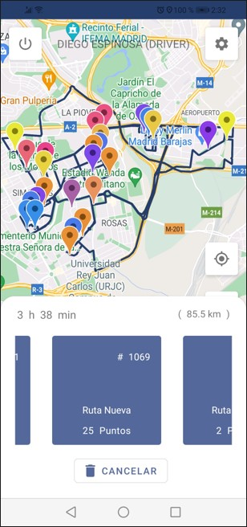
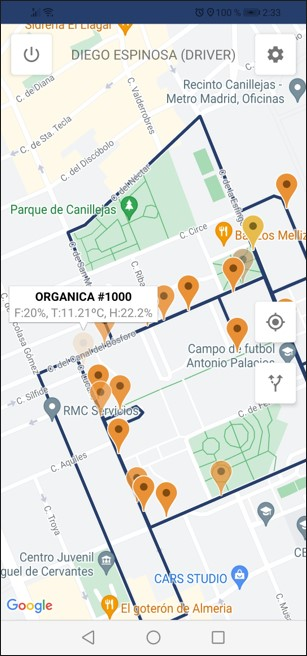

## Description

Geo Recycle is an application designed with a friendly graphical interface in **Adobe XD**, developed in Android Studio with **Java** programming language, implementing **Material Design** standards, **Firebase** database, **Google Maps** and **Google Directions API.**

The application seeks to improve the efficiency of the garbage collection system through the interaction of a system based on **IoT** which is what allows users to provide information, monitor and manage information on filling, temperature and humidity of garbage containers by means of simulated sensors.

It has user registration system functions, driver registration, container registration, visualization of registered containers with their respective information, calculation of distance between points and drawing of possible routes according to their location. That they are validated for greater security control and to guarantee their correct operation.

**Supports and functionalities:**

* CRUD
* Filter by ascending or descending
* Landscape/Portrait
* Responsive
* English and Spanish language
* Scalable

## Author

**Alejandro Martinez**

* [LinkedIn](https://www.linkedin.com/in/diego-alejandro-martinez-espinosa-571086134)

## Screenshots 

 
 
 

  

## Installation

This project requires to be installed on **Android mobile devices.** 

| Sdk      | Version      |
| :------- | :----------- |
| `min`    | **26**       |
| `target` | **31**       |

## Feedback

If you have any feedback, please reach out to us at dreamstime@outlook.es
