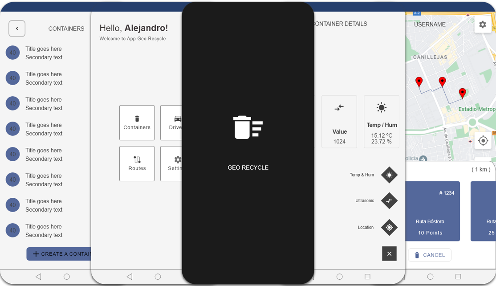
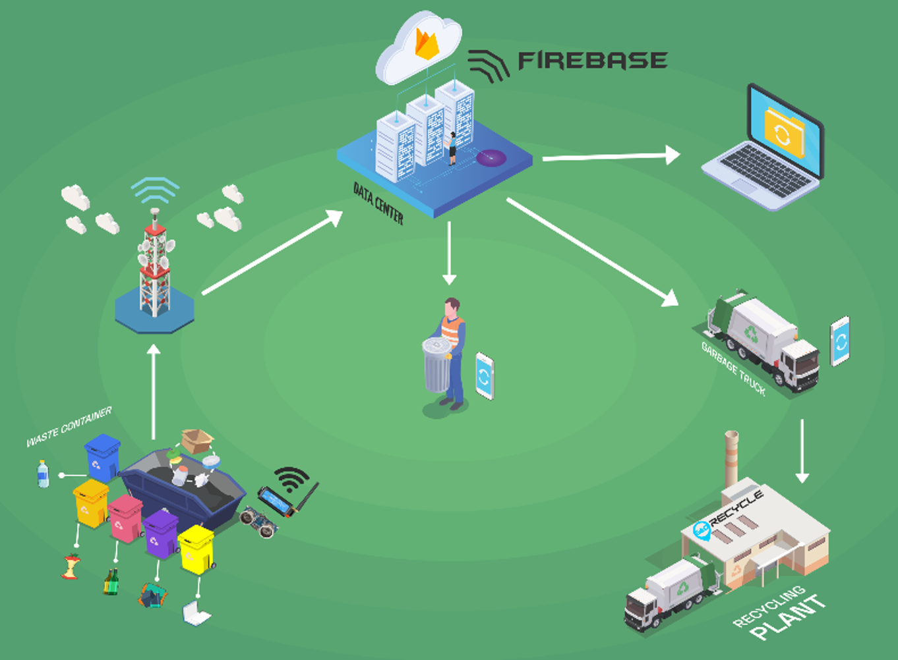
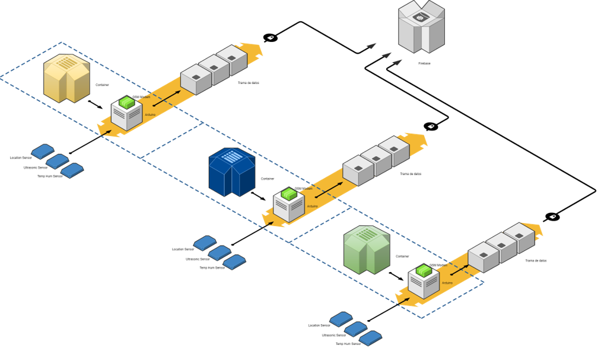

## Description

Geo Recycle is an application designed with a friendly graphical interface, developed in Android Studio with a **Java** programming language, implementing **Material Design** standards, **Firebase** database, **Google Maps** and ** Google Directions API**

The application seeks to improve the efficiency of the garbage collection system, provide information for users, monitor and manage the information on the filling of garbage containers. It has user registration system functions, driver registration, container registration, visualization of registered containers with their respective information, calculation of distance between points, drawing of possible routes according to its location and the percentage of filling of the garbage containers, etc. That they are validated for greater security control and guarantee their proper functioning.

**Supports and functionalities:**

* CRUD
* Filter by ascending or descending
* Landscape/Portrait
* Responsive
* English and Spanish language
* Scalable

## Author

**Alejandro Martinez**

* [LinkedIn](https://www.linkedin.com/in/diego-alejandro-martinez-espinosa-571086134)

## Screenshots 

 
 
 
 
 

## Installation

This project requires to be installed on **Android mobile devices.** 

| Sdk      | Version      |
| :------- | :----------- |
| `min`    | **26**       |
| `target` | **31**       |

## Feedback

If you have any feedback, please reach out to us at dreamstime@outlook.es
